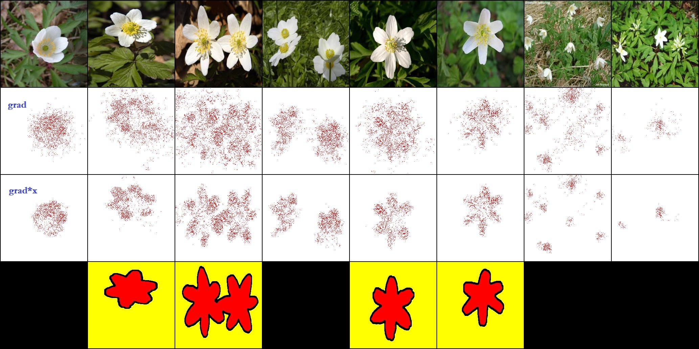

# Weakly Supervised Segmentation on Flower-17 Dataset

Code for paper: Attributional Robustness Training using Input-Gradient Spatial Alignment (ECCV 2020)

**Run**

    python train_art.py

**Validation**

Need to change some code to run the validation code. Now it can output images for comparison. Row 1 to row 4:
  - original image
  - gradients
  - gradients multiply pixel value
  - orginal mask (some mask is missing from official dataset)

### Flower 17 dataset

Flower17: [https://www.robots.ox.ac.uk/~vgg/data/flowers/17/](https://www.robots.ox.ac.uk/~vgg/data/flowers/17/)
